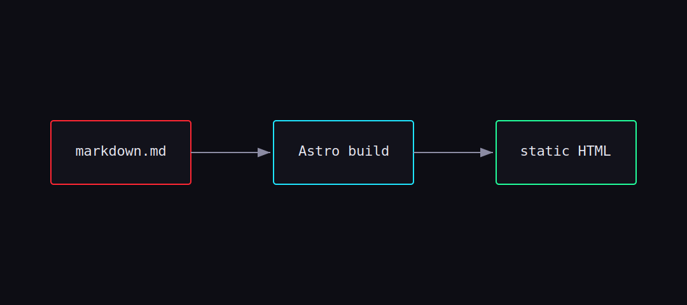

This is the first post on the new site. It exists to show what a post looks like —
headings, images, code, quotes, the works — and to document **how you add your own**.

## Adding a new post

Drop a Markdown file into `src/content/blog/`. The filename becomes the URL slug,
so `my-cool-post.md` is served at `/blog/my-cool-post`. Every post needs this
frontmatter block at the top:

```yaml
---
title: "Your title"
description: "One-line summary for cards and SEO."
pubDate: 2026-06-17
tags: ["tag-a", "tag-b"]
cover: ./cover.svg     # optional
---
```

That's it. The post shows up automatically on the home page and the blog index,
and the tag filter picks up your tags.

## Images

There are two ways to use images:

**1. Next to the Markdown file** (optimized automatically) — reference it with a
relative path:



**2. From the `public/` folder** — reference it with an absolute path like
`/images/photo.jpg`. Use this for things you don't want processed.

> Cover images use the same relative-path approach via the `cover:` frontmatter
> field, and they're type-checked at build time — a broken path fails the build
> instead of shipping a missing image.

## Code blocks

Fenced code blocks are syntax-highlighted with a dark theme that fits the palette:

```ts
function greet(name: string): string {
  return `// hello, ${name}`;
}
```

## Changing the look

Every color, font and effect lives in `src/config/theme.ts`. Want matrix green
instead of neon red? Swap one object. Want to kill the scanlines? Flip a boolean.
Nothing else in the codebase hardcodes a color.

---

Now go write something.
